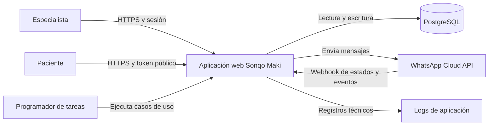
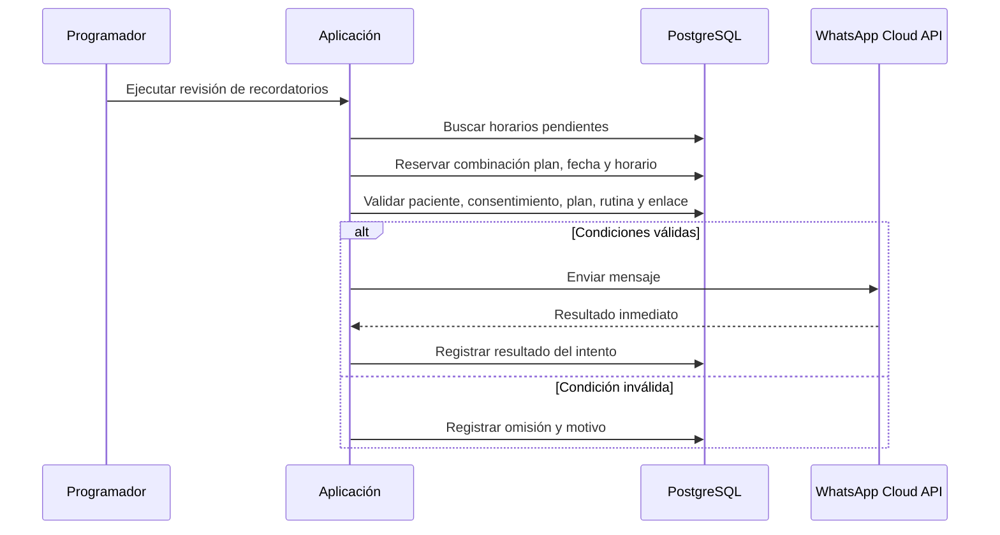
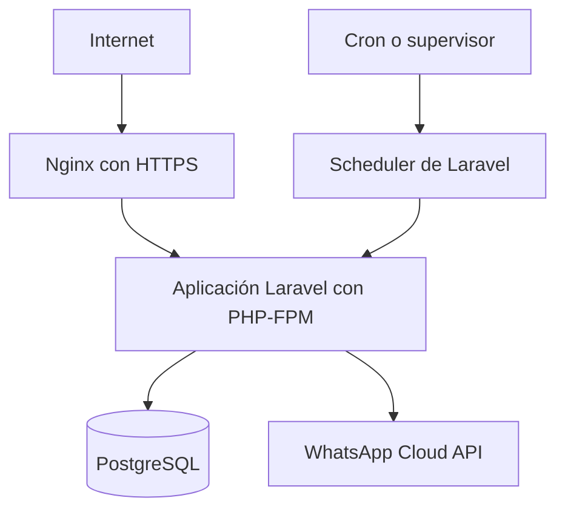

# Arquitectura general

## 1. Propósito

Este documento define la arquitectura general del MVP de Sonqo Maki. Su objetivo es servir como guía para la implementación, incluyendo el trabajo asistido por IA.

El detalle de entidades, atributos, relaciones, restricciones e índices se definirá por separado en [modelo-de-datos.md](modelo-de-datos.md).

## 2. Contexto del sistema

Sonqo Maki es una aplicación web para especialistas que permite gestionar pacientes, ejercicios, rutinas, planes de ejercicios y recordatorios enviados mediante WhatsApp Cloud API.

Los especialistas acceden mediante una cuenta creada manualmente. Los pacientes no tienen cuenta: consultan su rutina vigente mediante un enlace público seguro asociado a su plan.

El MVP será ejecutado inicialmente por el desarrollador en su propia computadora y se expondrá a Internet mediante un túnel seguro. Posteriormente, la misma aplicación se desplegará en un servidor privado virtual (VPS).

## 3. Decisiones arquitectónicas

| Tema                      | Decisión para el MVP                                                                  |
| ------------------------- | ------------------------------------------------------------------------------------- |
| Estilo de arquitectura    | Monolito modular                                                                      |
| Interfaz                  | Aplicación web renderizada por el servidor                                            |
| API independiente         | No se implementará una API separada inicialmente                                      |
| Base de datos             | PostgreSQL                                                                            |
| Autenticación             | Email y contraseña con sesiones tradicionales y cookies                               |
| Registro de especialistas | Creación manual en base de datos, sin registro público                                |
| Ejecución inicial         | Máquina del desarrollador expuesta mediante un túnel HTTPS                            |
| Despliegue posterior      | VPS, proveedor pendiente de definir                                                   |
| Zona horaria de negocio   | `America/Lima`                                                                        |
| Mensajería                | WhatsApp Cloud API con envíos reales y recepción de webhooks                          |
| Recordatorios             | Tarea programada activa únicamente mientras la aplicación esté en ejecución           |
| Eliminación               | Eliminación lógica de información funcional                                           |
| Auditoría de mensajes     | Los registros de envío se conservan y no se anonimizan                                |
| Enlaces públicos          | Token no predecible asociado al plan, vigente mientras corresponda al estado del plan |

## 4. Stack tecnológico recomendado

Se recomienda el siguiente stack para el MVP:

- **Backend y aplicación web:** Laravel con PHP.
- **Vistas:** Blade y componentes del lado del servidor.
- **Interactividad puntual:** Alpine.js cuando una interacción no justifique una aplicación frontend separada.
- **Estilos:** Tailwind CSS.
- **Base de datos:** PostgreSQL.
- **Acceso a datos:** ORM Eloquent y migraciones de Laravel.
- **Autenticación:** autenticación basada en sesión y cookies seguras.
- **Tareas programadas:** scheduler de Laravel, ejecutado como proceso de trabajo durante el desarrollo y mediante cron o un servicio equivalente en el VPS.
- **Integración externa:** cliente HTTP de Laravel para WhatsApp Cloud API.
- **Pruebas:** PHPUnit o Pest, eligiendo uno al iniciar el proyecto y manteniéndolo de forma consistente.
- **Servidor local:** servidor de desarrollo de Laravel.
- **Servidor en VPS:** Nginx, PHP-FPM, PostgreSQL y un proceso supervisado para las tareas programadas.

### 4.1 Motivos de la recomendación

Laravel encaja con el MVP porque ofrece en un solo framework autenticación por sesiones, validación, plantillas, acceso a PostgreSQL, migraciones, tareas programadas, logs y cliente HTTP. Esto permite mantener una sola aplicación y un solo repositorio, con una estructura conocida y fácil de extender.

Blade evita crear y mantener desde el inicio una API y una aplicación frontend separadas. Alpine.js puede cubrir interacciones pequeñas sin cambiar la arquitectura.

No se utilizarán microservicios, colas distribuidas, contenedores obligatorios ni un frontend SPA durante el MVP. Estas opciones podrán evaluarse si el volumen, el despliegue o la operación futura lo requieren.

## 5. Vista de contenedores

El programador de tareas forma parte del mismo código fuente y despliegue que la aplicación. Puede ejecutarse como un proceso separado, pero no constituye un servicio independiente ni posee lógica de negocio propia.

## 6. Monolito modular

La aplicación se organizará por módulos funcionales. Cada módulo agrupará sus controladores, casos de uso, reglas, validaciones y acceso a datos, respetando las convenciones de Laravel.

### 6.1 Módulos principales

- **Autenticación:** inicio y cierre de sesión de especialistas.
- **Especialistas:** datos mínimos de las cuentas creadas manualmente.
- **Pacientes:** registro, consulta, edición, activación y eliminación lógica.
- **Ejercicios:** biblioteca reutilizable de ejercicios.
- **Rutinas:** creación de rutinas y biblioteca de rutinas reutilizables.
- **Planes:** asignación de planes a pacientes, estados, fechas y duplicación entre pacientes.
- **Portal público:** resolución del token y presentación de la rutina vigente.
- **Recordatorios:** configuración de días, horarios y evaluación de envíos programados.
- **Mensajería WhatsApp:** composición, envío, recepción de webhooks y registro de resultados.
- **Operación y logs:** diagnóstico de tareas programadas, errores e integraciones.

### 6.2 Reglas entre módulos

- Los controladores reciben la solicitud, validan su forma y delegan la operación a un caso de uso.
- Las reglas de negocio no deben implementarse exclusivamente en vistas o controladores.
- El acceso a PostgreSQL se realiza mediante modelos y repositorios solo cuando estos últimos aporten una separación útil; no se crearán repositorios genéricos sin necesidad.
- WhatsApp se consume mediante una interfaz interna para permitir pruebas sin realizar envíos reales.
- El módulo público solo puede consultar la información necesaria para resolver y mostrar el plan asociado al token.
- Los módulos no deben acceder directamente a detalles internos de otro módulo cuando exista un caso de uso que represente la operación.

## 7. Capas internas

La implementación seguirá una separación sencilla:

1. **Presentación:** rutas, middleware, controladores, solicitudes validadas y vistas Blade.
2. **Aplicación:** casos de uso que coordinan cada operación del sistema.
3. **Dominio:** reglas de negocio, estados y decisiones que no dependen de HTTP.
4. **Infraestructura:** PostgreSQL, ORM, WhatsApp Cloud API, scheduler y logs.

Esta separación es lógica y vive dentro del mismo proyecto. No obliga a crear paquetes independientes ni una estructura excesivamente abstracta.

## 8. Flujos principales

### 8.1 Uso privado por el especialista

1. El especialista inicia sesión con email y contraseña.
2. El servidor valida las credenciales y crea una sesión.
3. La cookie de sesión acompaña las solicitudes posteriores.
4. Los controladores protegidos ejecutan los casos de uso correspondientes.
5. Los cambios se guardan en PostgreSQL.

### 8.2 Consulta pública de una rutina

1. El paciente abre una URL con un token no predecible.
2. El sistema busca el plan asociado sin exponer identificadores internos.
3. Evalúa el estado y las fechas del plan usando `America/Lima`.
4. Si el plan está activo y existe exactamente una rutina vigente, la muestra.
5. Si el plan está pausado, finalizado o no tiene una rutina disponible, muestra el estado correspondiente.

El token identifica al plan, no a una rutina específica. Su administración será manual durante el MVP y no vencerá automáticamente mientras el plan continúe activo. Debe ser posible invalidarlo o reemplazarlo mediante una operación administrativa, aunque inicialmente no exista una pantalla dedicada.

### 8.3 Envío programado de recordatorios

La combinación de plan, fecha y horario debe ser única para impedir mensajes duplicados, incluso si la tarea se ejecuta más de una vez. El derecho a procesar esa combinación debe obtenerse de forma atómica en PostgreSQL.

No habrá reintentos automáticos en el MVP. Cada envío fallido u omitido debe conservar un motivo suficientemente preciso para diagnóstico.

### 8.4 Recepción de webhooks de WhatsApp

La aplicación expondrá una ruta pública exclusiva para webhooks. Esta ruta deberá:

1. Atender la verificación inicial exigida por Meta.
2. Validar la autenticidad de las notificaciones recibidas.
3. Responder rápidamente antes de realizar procesamiento adicional.
4. Relacionar los estados de entrega con el registro de mensaje correspondiente cuando exista un identificador conocido.
5. Registrar eventos no reconocidos sin interrumpir el endpoint.
6. Evitar procesar dos veces el mismo evento.

En el MVP, el uso principal del webhook será actualizar estados técnicos de los mensajes enviados. Las respuestas conversacionales de pacientes no forman parte del alcance funcional; si Meta las entrega, podrán registrarse como evento técnico o ignorarse de manera controlada.

## 9. Persistencia y manejo de datos

PostgreSQL será la única fuente de verdad de la aplicación. El modelo completo se definirá en `modelo-de-datos.md`.

Se aplicarán los siguientes criterios generales:

- Las entidades funcionales recuperables utilizarán eliminación lógica.
- Las consultas normales excluirán registros eliminados lógicamente.
- La restauración podrá realizarse inicialmente mediante una operación técnica, sin requerir una pantalla en el MVP.
- Los registros de mensajes, intentos, omisiones y errores no se eliminarán al eliminar lógicamente un paciente o plan.
- Los registros técnicos conservarán la referencia necesaria para investigar fallos y no serán anonimizados en el MVP.
- Las migraciones de base de datos formarán parte del repositorio y serán la única vía normal para modificar el esquema.
- Las fechas de auditoría se almacenarán de forma consistente; las decisiones de calendario del negocio se resolverán en `America/Lima`.

La política anterior ajusta la eliminación en cascada descrita inicialmente en algunos requisitos: la eliminación funcional será lógica y el historial técnico de mensajería se conservará. Los documentos de requisitos deberán alinearse con esta decisión para evitar contradicciones durante la implementación.

## 10. Seguridad

### 10.1 Área privada

- Las contraseñas se almacenarán únicamente como hashes seguros, con el costo definido en los requisitos no funcionales.
- La autenticación usará cookies de sesión `HttpOnly`, `Secure` cuando exista HTTPS y una política `SameSite` apropiada.
- Las rutas privadas exigirán autenticación.
- Los formularios y operaciones mutables tendrán protección CSRF.
- La sesión se regenerará después del inicio de sesión y se invalidará al cerrar sesión.
- No existirá registro público ni recuperación automática de contraseña en el MVP.

### 10.2 Área pública

- Los tokens se generarán con aleatoriedad criptográficamente segura y suficiente longitud.
- El token no contendrá DNI, teléfono, identificadores consecutivos ni otros datos deducibles.
- Las respuestas públicas no revelarán si existe un paciente independiente del plan consultado.
- Los tokens no se escribirán completos en logs de acceso o aplicación; cuando sea necesario identificarlos se usará una versión truncada o una huella.
- Se aplicará limitación básica de solicitudes al endpoint público y al webhook.

### 10.3 Secretos e integración

- Las credenciales de PostgreSQL, la clave de aplicación, los tokens de Meta y los secretos del webhook se almacenarán en variables de entorno.
- Los archivos locales con secretos no se versionarán.
- El túnel y el despliegue en VPS deberán ofrecer HTTPS válido.
- El endpoint de webhook validará la firma enviada por Meta, además del proceso de verificación inicial.

## 11. Logs y observabilidad

Los logs deben permitir responder qué ocurrió, cuándo, para qué plan y por qué no se envió un mensaje, sin exponer secretos ni el token público completo.

Cada ejecución programada deberá registrar como mínimo:

- identificador de ejecución;
- fecha y hora;
- plan y recordatorio evaluados;
- horario programado;
- resultado: enviado, omitido o fallido;
- motivo normalizado;
- identificador de mensaje devuelto por WhatsApp, si existe;
- código de respuesta externa y detalle seguro del error;
- duración de la operación.

Los motivos deben usar códigos estables, por ejemplo: `PACIENTE_INACTIVO`, `SIN_CONSENTIMIENTO`, `PLAN_NO_ACTIVO`, `FUERA_DE_RANGO`, `SIN_RUTINA_VIGENTE`, `RUTINAS_SUPERPUESTAS`, `ENLACE_NO_DISPONIBLE`, `YA_PROCESADO` y `ERROR_WHATSAPP`.

Durante el desarrollo, los logs podrán escribirse en archivos y consultarse directamente. En el VPS deberán conservarse mediante rotación para evitar el crecimiento ilimitado del disco. Los resultados de mensajería que deban consultarse o relacionarse se almacenarán además en PostgreSQL; un archivo de log no reemplaza el historial persistente.

## 12. Ejecución y despliegue

### 12.1 Entorno local expuesto a Internet

La ejecución inicial tendrá estos componentes:

- aplicación Laravel;
- PostgreSQL;
- proceso del scheduler;
- túnel HTTPS hacia la aplicación;
- variables de entorno locales;
- archivos de log.

La aplicación, el scheduler, PostgreSQL y el túnel deberán permanecer activos para que el servicio, los recordatorios y los webhooks funcionen. Si la computadora se suspende, pierde Internet o detiene alguno de esos procesos, no se garantiza el envío de recordatorios. Como el MVP no tendrá reintentos automáticos, esta limitación debe considerarse parte de la operación inicial.

La URL pública usada por Meta debe ser estable mientras la integración esté configurada. Si el proveedor del túnel cambia la URL al reiniciarse, será necesario actualizar la configuración del webhook y cualquier configuración externa relacionada.

### 12.2 Despliegue futuro en VPS

El despliegue deberá usar el mismo repositorio y las mismas migraciones que el entorno local. Las diferencias entre entornos se limitarán principalmente a variables de entorno, URL pública, credenciales, configuración de logs y procesos del servidor.

La selección del proveedor de VPS queda pendiente. Para el MVP no se requiere diseñar alta disponibilidad, balanceo de carga ni escalado horizontal.

## 13. Pruebas mínimas

La implementación deberá incluir pruebas automatizadas para las reglas de mayor riesgo:

- autenticación y protección de rutas privadas;
- unicidad y normalización del teléfono del paciente;
- estados y fechas de los planes;
- continuidad y no superposición de rutinas;
- resolución de la rutina vigente por token;
- duplicación de planes entre pacientes;
- biblioteca y reutilización de rutinas;
- evaluación de condiciones previas al envío;
- idempotencia de plan, fecha y horario;
- registro de envíos fallidos u omitidos;
- verificación, autenticidad e idempotencia de webhooks.

Las pruebas de integración con WhatsApp usarán un cliente sustituible o simulado. Además, antes de habilitar el uso real se realizará al menos una prueba manual controlada con las credenciales del entorno correspondiente.

## 14. Decisiones pendientes

Las siguientes decisiones no bloquean la arquitectura general, pero deberán resolverse antes o durante la implementación:

- proveedor y modalidad del túnel HTTPS;
- proveedor y características del VPS;
- configuración definitiva de WhatsApp Cloud API;
- contenido exacto de los eventos de webhook que se conservarán;
- período de retención y rotación de logs;
- mecanismo técnico para crear y restaurar especialistas, pacientes o planes sin pantalla administrativa;
- definición detallada del modelo de datos;
- estrategia de copias de seguridad de PostgreSQL para el entorno expuesto y el VPS.

## 15. Criterios para evolucionar la arquitectura

La separación de una API, un frontend independiente, una cola de trabajos o servicios adicionales solo deberá evaluarse cuando exista una necesidad comprobable, por ejemplo:

- una aplicación móvil u otro consumidor requiera una API;
- aumente considerablemente el volumen de recordatorios;
- los envíos necesiten reintentos, procesamiento diferido o aislamiento;
- varios procesos de aplicación deban ejecutarse en paralelo;
- se requiera disponibilidad superior a la que ofrece un único VPS.

Hasta entonces, el monolito modular será la arquitectura oficial del MVP.
