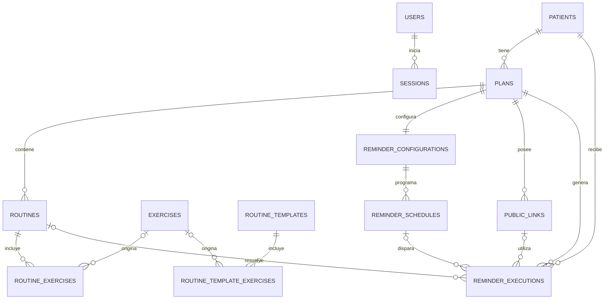

# Modelo de datos

## 1. Propósito

Este documento define el modelo de datos inicial del MVP de Sonqo Maki para PostgreSQL y Laravel. Es la referencia para crear migraciones, modelos Eloquent, relaciones, validaciones y pruebas de integridad.

El modelo deriva de la documentación de producto, requisitos, reglas de negocio, casos de uso, features y de [arquitectura-general.md](arquitectura-general.md). Cuando existen contradicciones, prevalecen las decisiones arquitectónicas más recientes y las decisiones expresas tomadas para el MVP.

## 2. Criterios generales

- PostgreSQL es la única fuente de verdad.
- Los nombres físicos de tablas y columnas se escriben en inglés para seguir las convenciones de Laravel.
- Las claves primarias usan `bigint` autoincremental, salvo los identificadores de sesión.
- Los instantes usan `timestamp with time zone` (`timestamptz`) y se almacenan en UTC.
- Las fechas de planes y rutinas usan `date`, porque representan días calendario.
- Los horarios de recordatorio usan `time without time zone` y se interpretan siempre en `America/Lima`.
- Las entidades funcionales recuperables usan `deleted_at` para eliminación lógica.
- Los registros técnicos de recordatorios no usan eliminación lógica ni se eliminan durante el MVP.
- Todos los textos obligatorios deben guardarse recortados y no pueden quedar vacíos.
- Los estados se almacenan como texto con restricciones `CHECK`, evitando depender de enums nativos de PostgreSQL en la primera versión.
- Las reglas que involucran varias filas o tablas se validan dentro de transacciones de aplicación y, cuando sea posible, se refuerzan con índices o restricciones de PostgreSQL.

## 3. Prioridad ante contradicciones documentales

Este modelo adopta las siguientes decisiones:

1. **Archivo lógico:** los datos funcionales se conservan para recuperación y el historial técnico mínimo permanece disponible. La purga se definirá antes del despliegue productivo.
2. **Biblioteca de rutinas:** forma parte del MVP y produce copias independientes dentro de los planes.
3. **Sin webhooks:** el MVP conserva solamente el resultado inmediato de la solicitud a WhatsApp.
4. **Tokens públicos:** se generan al activar un plan por primera vez, pertenecen exclusivamente a ese plan y solo una operación técnica autorizada puede revocarlos o rotarlos.
5. **Historial preservado:** las ejecuciones conservan referencias y copias mínimas de identificación aunque el paciente o el plan se archiven.

## 4. Diagrama entidad-relación



La relación entre ejercicios de biblioteca y ejercicios configurados es opcional desde la copia hacia el origen. La copia conserva todos los valores necesarios y continúa siendo válida aunque el ejercicio original se elimine lógicamente.

## 5. Catálogo de tablas

### 5.1 `users`

Representa las cuentas de especialistas creadas manualmente. Todas las cuentas tienen las mismas capacidades; no existen roles ni permisos diferenciados.

| Columna      | Tipo           | Nulable | Reglas                          |
| ------------ | -------------- | ------- | ------------------------------- |
| `id`         | `bigint`       | No      | Clave primaria                  |
| `email`      | `varchar(320)` | No      | Normalizado a minúsculas, único |
| `password`   | `varchar(255)` | No      | Hash seguro; nunca texto plano  |
| `is_active`  | `boolean`      | No      | Valor inicial `true`            |
| `created_at` | `timestamptz`  | No      | Auditoría técnica               |
| `updated_at` | `timestamptz`  | No      | Control de cambios              |
| `deleted_at` | `timestamptz`  | Sí      | Eliminación lógica              |

Restricciones e índices:

- Índice único sobre `lower(email)`.
- Una cuenta eliminada o inactiva no puede iniciar sesión.
- La creación manual debe realizarse mediante un comando de aplicación que genere el hash, no insertando una contraseña legible directamente en PostgreSQL.

No se agrega nombre, rol, permisos ni datos de perfil porque no son necesarios para el MVP.

### 5.2 `sessions`

Almacena las sesiones tradicionales cuando Laravel use el controlador de sesiones de base de datos.

| Columna         | Tipo           | Nulable | Reglas                                     |
| --------------- | -------------- | ------- | ------------------------------------------ |
| `id`            | `varchar(255)` | No      | Clave primaria generada por Laravel        |
| `user_id`       | `bigint`       | Sí      | FK a `users.id`                            |
| `ip_address`    | `varchar(45)`  | Sí      | IPv4 o IPv6                                |
| `user_agent`    | `text`         | Sí      | Agente del navegador                       |
| `payload`       | `text`         | No      | Contenido de sesión gestionado por Laravel |
| `last_activity` | `integer`      | No      | Marca temporal Unix usada por Laravel      |

Índices sobre `user_id` y `last_activity`. Las sesiones vencidas o cerradas se eliminan físicamente; no forman parte del historial funcional.

### 5.3 `patients`

Representa al paciente sin cuenta que recibe recordatorios y posee planes.

| Columna                 | Tipo           | Nulable | Reglas                                               |
| ----------------------- | -------------- | ------- | ---------------------------------------------------- |
| `id`                    | `bigint`       | No      | Clave primaria                                       |
| `first_names`           | `varchar(120)` | No      | Texto no vacío                                       |
| `last_names`            | `varchar(120)` | No      | Texto no vacío                                       |
| `dni`                   | `varchar(8)`   | Sí      | Ocho dígitos cuando exista; conserva ceros iniciales |
| `whatsapp_phone`        | `varchar(12)`  | No      | Formato canónico `+51` más nueve dígitos             |
| `status`                | `varchar(20)`  | No      | `active` o `inactive`; inicial `active`              |
| `whatsapp_consented_on` | `date`         | Sí      | Evidencia básica de consentimiento                   |
| `created_at`            | `timestamptz`  | No      | Auditoría técnica                                    |
| `updated_at`            | `timestamptz`  | No      | También se usa para detectar edición concurrente     |
| `deleted_at`            | `timestamptz`  | Sí      | Eliminación lógica                                   |

Restricciones e índices:

- `CHECK (dni IS NULL OR dni ~ '^[0-9]{8}$')`.
- `CHECK (whatsapp_phone ~ '^\\+51[0-9]{9}$')`.
- `CHECK (status IN ('active', 'inactive'))`.
- Unicidad global de `dni` y `whatsapp_phone`, incluyendo registros eliminados lógicamente.
- Índices de consulta sobre `deleted_at`, `status`, `last_names` y `first_names`.

Los identificadores quedan reservados mientras el paciente sea recuperable. Una futura purga física podrá liberarlos; si se decide permitir su reutilización antes, deberá definirse cómo resolver una restauración en conflicto.

### 5.4 `exercises`

Biblioteca reutilizable de ejercicios. No almacena archivos, solo una URL externa opcional.

| Columna            | Tipo           | Nulable | Reglas                                          |
| ------------------ | -------------- | ------- | ----------------------------------------------- |
| `id`               | `bigint`       | No      | Clave primaria                                  |
| `name`             | `varchar(160)` | No      | Texto no vacío                                  |
| `description`      | `text`         | Sí      | Instrucción base                                |
| `duration_seconds` | `integer`      | Sí      | Mayor que cero                                  |
| `sets`             | `smallint`     | Sí      | Mayor que cero                                  |
| `repetitions`      | `smallint`     | Sí      | Mayor que cero                                  |
| `material_url`     | `text`         | Sí      | URL `http` o `https` validada por la aplicación |
| `created_at`       | `timestamptz`  | No      | Auditoría técnica                               |
| `updated_at`       | `timestamptz`  | No      | Control de cambios                              |
| `deleted_at`       | `timestamptz`  | Sí      | Eliminación lógica                              |

No se exige nombre único: pueden existir ejercicios con nombres iguales e indicaciones distintas. Cada valor numérico presente debe cumplir `valor > 0`.

`duration_seconds` evita almacenar una duración ambigua. La interfaz puede mostrarla en minutos y segundos.

### 5.5 `routine_templates`

Biblioteca de rutinas reutilizables, independiente de pacientes y planes. No contiene fechas porque estas dependen del plan donde se copie la plantilla.

| Columna      | Tipo           | Nulable | Reglas             |
| ------------ | -------------- | ------- | ------------------ |
| `id`         | `bigint`       | No      | Clave primaria     |
| `name`       | `varchar(160)` | No      | Texto no vacío     |
| `status`     | `varchar(20)`  | No      | `active` o `archived`; inicial `active` |
| `created_at` | `timestamptz`  | No      | Auditoría técnica  |
| `updated_at` | `timestamptz`  | No      | Control de cambios |
| `deleted_at` | `timestamptz`  | Sí      | Eliminación lógica |

Restricciones e índices:

- `CHECK (status IN ('active', 'archived'))`.
- Índice sobre `status` y `name` para filtrado rápido en la biblioteca.

Usar una plantilla crea nuevas filas en `routines` y `routine_exercises`; la rutina del plan no conserva una dependencia operativa con la plantilla.

Una plantilla archivada (`status = 'archived'`) deja de aparecer en el listado principal de la biblioteca y pasa a una sección separada de archivados. Las copias ya generadas a partir de ella en planes existentes no se ven afectadas. Una plantilla archivada puede restaurarse a `active` si el especialista lo requiere.

### 5.6 `routine_template_exercises`

Contiene copias configurables de ejercicios dentro de una plantilla de rutina.

| Columna               | Tipo           | Nulable | Reglas                         |
| --------------------- | -------------- | ------- | ------------------------------ |
| `id`                  | `bigint`       | No      | Clave primaria                 |
| `routine_template_id` | `bigint`       | No      | FK a `routine_templates.id`    |
| `source_exercise_id`  | `bigint`       | Sí      | FK opcional a `exercises.id`   |
| `position`            | `smallint`     | No      | Entero mayor que cero          |
| `name`                | `varchar(160)` | No      | Copia del nombre del ejercicio |
| `description`         | `text`         | Sí      | Copia configurable             |
| `duration_seconds`    | `integer`      | Sí      | Mayor que cero                 |
| `sets`                | `smallint`     | Sí      | Mayor que cero                 |
| `repetitions`         | `smallint`     | Sí      | Mayor que cero                 |
| `material_url`        | `text`         | Sí      | URL externa opcional           |
| `created_at`          | `timestamptz`  | No      | Auditoría técnica              |
| `updated_at`          | `timestamptz`  | No      | Control de cambios             |
| `deleted_at`          | `timestamptz`  | Sí      | Eliminación lógica             |

La combinación de `routine_template_id` y `position` debe ser única entre filas no eliminadas. La aplicación reordena posiciones dentro de una transacción.

### 5.7 `plans`

Contenedor temporal de rutinas asociado a un único paciente.

| Columna      | Tipo           | Nulable | Reglas                                            |
| ------------ | -------------- | ------- | ------------------------------------------------- |
| `id`         | `bigint`       | No      | Clave primaria                                    |
| `patient_id` | `bigint`       | No      | FK a `patients.id`                                |
| `name`       | `varchar(160)` | No      | Texto no vacío                                    |
| `starts_on`  | `date`         | No      | Inicio inclusivo                                  |
| `ends_on`    | `date`         | No      | Fin inclusivo                                     |
| `status`     | `varchar(20)`  | No      | `active`, `paused` o `finished`; inicial `paused` |
| `created_at` | `timestamptz`  | No      | Auditoría técnica                                 |
| `updated_at` | `timestamptz`  | No      | También se usa para detectar edición concurrente  |
| `deleted_at` | `timestamptz`  | Sí      | Eliminación lógica                                |

Restricciones e índices:

- `CHECK (starts_on <= ends_on)`.
- `CHECK (status IN ('active', 'paused', 'finished'))`.
- Índices sobre `patient_id`, `(patient_id, status)`, `(starts_on, ends_on)` y `deleted_at`.
- No existe restricción de exclusión entre planes: un paciente puede tener varios planes activos y superpuestos.
- Todo plan nuevo se crea en estado `paused`.

No se persiste una rutina vigente ni un estado calculado de vencimiento. Ambos se resuelven con la fecha actual en `America/Lima`. Si la fecha supera `ends_on`, el sistema trata el plan como finalizado aunque `status` todavía sea `active`.

### 5.8 `routines`

Representa una rutina concreta dentro de un plan. Es una copia independiente y editable.

| Columna      | Tipo           | Nulable | Reglas             |
| ------------ | -------------- | ------- | ------------------ |
| `id`         | `bigint`       | No      | Clave primaria     |
| `plan_id`    | `bigint`       | No      | FK a `plans.id`    |
| `name`       | `varchar(160)` | No      | Texto no vacío     |
| `starts_on`  | `date`         | No      | Inicio inclusivo   |
| `ends_on`    | `date`         | No      | Fin inclusivo      |
| `created_at` | `timestamptz`  | No      | Auditoría técnica  |
| `updated_at` | `timestamptz`  | No      | Control de cambios |
| `deleted_at` | `timestamptz`  | Sí      | Eliminación lógica |

Restricciones e índices:

- `CHECK (starts_on <= ends_on)`.
- Índice sobre `(plan_id, starts_on, ends_on)`.
- Exclusión recomendada en PostgreSQL para impedir solapamientos entre rutinas no eliminadas del mismo plan:

```sql
EXCLUDE USING gist (
    plan_id WITH =,
    daterange(starts_on, ends_on, '[]') WITH &&
)
WHERE (deleted_at IS NULL);
```

Esta restricción requiere la extensión `btree_gist`. Si no se habilita, la aplicación debe bloquear el plan y validar superposiciones dentro de la misma transacción.

Que las fechas estén dentro del plan y que la cobertura sea continua son reglas entre filas y tablas; se validan mediante el servicio de dominio descrito en la sección 8.

### 5.9 `routine_exercises`

Es la copia de un ejercicio configurada para una rutina concreta. Sus valores son una fotografía independiente de la biblioteca.

| Columna              | Tipo           | Nulable | Reglas                       |
| -------------------- | -------------- | ------- | ---------------------------- |
| `id`                 | `bigint`       | No      | Clave primaria               |
| `routine_id`         | `bigint`       | No      | FK a `routines.id`           |
| `source_exercise_id` | `bigint`       | Sí      | FK opcional a `exercises.id` |
| `position`           | `smallint`     | No      | Entero mayor que cero        |
| `name`               | `varchar(160)` | No      | Copia del nombre             |
| `description`        | `text`         | Sí      | Copia de la indicación       |
| `duration_seconds`   | `integer`      | Sí      | Mayor que cero               |
| `sets`               | `smallint`     | Sí      | Mayor que cero               |
| `repetitions`        | `smallint`     | Sí      | Mayor que cero               |
| `material_url`       | `text`         | Sí      | URL externa opcional         |
| `created_at`         | `timestamptz`  | No      | Auditoría técnica            |
| `updated_at`         | `timestamptz`  | No      | Control de cambios           |
| `deleted_at`         | `timestamptz`  | Sí      | Eliminación lógica           |

Restricciones:

- `CHECK (position > 0)` y comprobaciones positivas para valores numéricos opcionales.
- Índice único parcial sobre `(routine_id, position) WHERE deleted_at IS NULL`.
- Una rutina utilizable debe contener al menos un ejercicio no eliminado.

Editar `exercises` nunca actualiza estas filas. Esta duplicación deliberada evita cambios retroactivos en planes de pacientes.

### 5.10 `public_links`

Mantiene el enlace seguro asociado exclusivamente a un plan. El primer enlace se crea durante la primera activación válida; los registros revocados se conservan para trazabilidad y nunca se reasignan a otro plan.

| Columna            | Tipo          | Nulable | Reglas                                      |
| ------------------ | ------------- | ------- | ------------------------------------------- |
| `id`               | `bigint`      | No      | Clave primaria                              |
| `plan_id`          | `bigint`      | No      | FK a `plans.id`                             |
| `token_hash`       | `char(64)`    | No      | SHA-256 hexadecimal del token, único        |
| `token_ciphertext` | `text`        | No      | Token cifrado con la clave de la aplicación |
| `token_prefix`     | `varchar(12)` | No      | Prefijo no sensible para diagnóstico        |
| `revoked_at`       | `timestamptz` | Sí      | Nulo mientras el enlace sea válido          |
| `created_at`       | `timestamptz` | No      | Auditoría técnica                           |
| `updated_at`       | `timestamptz` | No      | Control de cambios                          |

Reglas:

- El token se genera con al menos 32 bytes aleatorios y se codifica con Base64 URL-safe.
- La búsqueda pública calcula SHA-256 del token recibido y consulta `token_hash`.
- `token_ciphertext` permite reconstruir la URL para futuros recordatorios sin almacenar el token en texto plano.
- La regla “no almacenar tokens públicos en texto plano” exige esta combinación de hash y cifrado; no exige eliminar `token_ciphertext`. Un esquema de solo hash impediría reutilizar el enlace vigente en recordatorios futuros.
- Solo puede existir un enlace no revocado por plan mediante índice único parcial sobre `plan_id WHERE revoked_at IS NULL`.
- Un enlace no puede cambiar de `plan_id` después de crearse.
- Esta inmutabilidad se refuerza mediante un trigger PostgreSQL, además de excluir `plan_id` de la asignación masiva del modelo.
- No existe `expires_at`: el enlace no vence automáticamente. La disponibilidad depende del token, el plan, sus fechas y su estado.
- Reemplazar un token revoca el actual y crea otro dentro de una transacción.
- El token completo no se escribe en logs ni en el historial de envíos.
- Rotar la clave de cifrado de la aplicación exige descifrar y volver a cifrar los tokens antes de retirar la clave anterior.

### 5.11 `reminder_configurations`

Controla globalmente si la programación de un plan está activa o pausada.

| Columna      | Tipo          | Nulable | Reglas                |
| ------------ | ------------- | ------- | --------------------- |
| `id`         | `bigint`      | No      | Clave primaria        |
| `plan_id`    | `bigint`      | No      | FK única a `plans.id` |
| `is_active`  | `boolean`     | No      | Inicial `false`       |
| `created_at` | `timestamptz` | No      | Auditoría técnica     |
| `updated_at` | `timestamptz` | No      | Control de cambios    |

Se crea junto al plan en estado inactivo. Activar recordatorios no activa el plan ni omite las demás condiciones de envío.

### 5.12 `reminder_schedules`

Representa un horario semanal concreto de un plan.

| Columna                     | Tipo          | Nulable | Reglas                            |
| --------------------------- | ------------- | ------- | --------------------------------- |
| `id`                        | `bigint`      | No      | Clave primaria                    |
| `reminder_configuration_id` | `bigint`      | No      | FK a `reminder_configurations.id` |
| `weekday`                   | `smallint`    | No      | ISO-8601: lunes `1` a domingo `7` |
| `send_at`                   | `time(0)`     | No      | Hora local de `America/Lima`      |
| `created_at`                | `timestamptz` | No      | Auditoría técnica                 |
| `updated_at`                | `timestamptz` | No      | Control de cambios                |
| `deleted_at`                | `timestamptz` | Sí      | Eliminación lógica                |

Restricciones:

- `CHECK (weekday BETWEEN 1 AND 7)`.
- Índice único parcial sobre `(reminder_configuration_id, weekday, send_at) WHERE deleted_at IS NULL`.
- Máximo dos filas no eliminadas por configuración y día.

El máximo de dos no puede expresarse con un `CHECK` simple. La aplicación debe bloquear la fila de `reminder_configurations`, contar los horarios del día y guardar dentro de una transacción. Una prueba de concurrencia debe comprobar esta regla.

### 5.13 `reminder_executions`

Es el historial persistente de cada combinación programada procesada. También funciona como llave de idempotencia y registra envíos aceptados, fallidos u omitidos antes de llamar a WhatsApp.

| Columna                    | Tipo           | Nulable | Reglas                                         |
| -------------------------- | -------------- | ------- | ---------------------------------------------- |
| `id`                       | `bigint`       | No      | Clave primaria                                 |
| `correlation_id`           | `uuid`         | No      | Identificador único para relacionar logs       |
| `plan_id`                  | `bigint`       | No      | FK a `plans.id`                                |
| `patient_id`               | `bigint`       | No      | FK a `patients.id`                             |
| `reminder_schedule_id`     | `bigint`       | Sí      | FK al horario que originó la ejecución         |
| `routine_id`               | `bigint`       | Sí      | FK a la rutina resuelta, si existió            |
| `public_link_id`           | `bigint`       | Sí      | FK al enlace usado, sin copiar el token        |
| `scheduled_local_date`     | `date`         | No      | Fecha de negocio en `America/Lima`             |
| `scheduled_local_time`     | `time(0)`      | No      | Horario de negocio                             |
| `scheduled_at`             | `timestamptz`  | No      | Instante UTC equivalente                       |
| `started_at`               | `timestamptz`  | No      | Inicio real del procesamiento                  |
| `completed_at`             | `timestamptz`  | Sí      | Fin del procesamiento                          |
| `outcome`                  | `varchar(20)`  | No      | `processing`, `omitted`, `accepted` o `failed` |
| `reason_code`              | `varchar(60)`  | Sí      | Motivo normalizado de omisión o fallo          |
| `patient_name_snapshot`    | `varchar(241)` | No      | Nombre mostrado al momento de procesar         |
| `recipient_phone_snapshot` | `varchar(12)`  | No      | Destinatario evaluado                          |
| `plan_name_snapshot`       | `varchar(160)` | No      | Nombre del plan al procesar                    |
| `whatsapp_message_id`      | `varchar(255)` | Sí      | Identificador devuelto por Meta                |
| `provider_http_status`     | `smallint`     | Sí      | Código HTTP si hubo llamada                    |
| `provider_error_code`      | `varchar(100)` | Sí      | Código técnico seguro                          |
| `provider_error_detail`    | `text`         | Sí      | Detalle sanitizado, sin credenciales           |
| `duration_ms`              | `integer`      | Sí      | Duración total no negativa                     |
| `created_at`               | `timestamptz`  | No      | Auditoría técnica                              |
| `updated_at`               | `timestamptz`  | No      | Actualización del resultado                    |

Restricciones e índices:

- Unicidad sobre `(plan_id, scheduled_local_date, scheduled_local_time)`; esta es la garantía principal contra duplicados.
- Unicidad sobre `correlation_id`.
- Índice único parcial sobre `whatsapp_message_id WHERE whatsapp_message_id IS NOT NULL`.
- Índices para historial sobre `started_at`, `outcome`, `patient_id` y `plan_id`.
- `duration_ms >= 0` cuando exista.
- `CHECK (outcome IN ('processing', 'omitted', 'accepted', 'failed'))`.

Una fila `accepted` significa que WhatsApp aceptó la solicitud, no que el mensaje fue entregado, leído o que el paciente realizó la rutina.

Motivos iniciales recomendados:

| Código                        | Significado                      |
| ----------------------------- | -------------------------------- |
| `PATIENT_INACTIVE`            | Paciente inactivo                |
| `INVALID_PHONE`               | Teléfono no utilizable           |
| `NO_CONSENT`                  | Sin fecha de consentimiento      |
| `PLAN_NOT_ACTIVE`             | Plan pausado o finalizado        |
| `OUTSIDE_PLAN_RANGE`          | Fecha fuera del rango            |
| `REMINDERS_PAUSED`            | Configuración global pausada     |
| `INCOMPLETE_ROUTINE_COVERAGE` | El rango del plan tiene huecos   |
| `OVERLAPPING_ROUTINES`        | Existen rutinas superpuestas     |
| `NO_CURRENT_ROUTINE`          | No existe rutina vigente         |
| `MULTIPLE_CURRENT_ROUTINES`   | Existe más de una rutina vigente |
| `ROUTINE_WITHOUT_EXERCISES`   | Rutina vigente vacía             |
| `PUBLIC_LINK_UNAVAILABLE`     | Enlace ausente o revocado        |
| `WHATSAPP_ERROR`              | Error o rechazo de la API        |
| `UNEXPECTED_ERROR`            | Fallo interno no clasificado     |

`ALREADY_PROCESSED` se escribe en el log de aplicación cuando el `INSERT` pierde el conflicto de unicidad; no se crea una segunda fila en esta tabla.

## 6. Relaciones y cardinalidades

| Origen                    | Relación        | Destino                      | Regla                                                  |
| ------------------------- | --------------- | ---------------------------- | ------------------------------------------------------ |
| `patients`                | 1 a N           | `plans`                      | Un plan pertenece a un solo paciente                   |
| `plans`                   | 1 a N           | `routines`                   | Un plan utilizable tiene una o más rutinas             |
| `routines`                | 1 a N           | `routine_exercises`          | Una rutina utilizable tiene uno o más ejercicios       |
| `exercises`               | 1 a N opcional  | Copias de ejercicios         | La referencia al origen no controla la copia           |
| `routine_templates`       | 1 a N           | `routine_template_exercises` | Una plantilla utilizable contiene ejercicios ordenados |
| `plans`                   | 1 a 1           | `reminder_configurations`    | Toda configuración pertenece a un plan                 |
| `reminder_configurations` | 1 a N           | `reminder_schedules`         | Puede no tener horarios mientras se configura          |
| `plans`                   | 1 a N histórico | `public_links`               | Solo uno puede estar vigente a la vez                  |
| `plans`                   | 1 a N           | `reminder_executions`        | El historial se conserva permanentemente en el MVP     |

Todos los datos funcionales son compartidos por los especialistas autenticados del MVP. No se agrega `user_id` como propietario de pacientes, ejercicios o planes porque no existe multi-tenencia ni visibilidad separada por especialista.

## 7. Política de claves foráneas

- Las relaciones funcionales obligatorias usan claves foráneas con `ON DELETE RESTRICT`.
- La eliminación normal del MVP es lógica; no se depende de `ON DELETE CASCADE`.
- `source_exercise_id` puede usar `ON DELETE SET NULL` ante una futura purga física, porque la copia conserva todos sus datos.
- Los registros técnicos no deben quedar huérfanos. Una purga física de pacientes o planes requerirá una política de retención nueva y una migración explícita.
- Las sesiones pueden usar `ON DELETE CASCADE` frente a una futura eliminación física de la cuenta, porque son datos temporales.

## 8. Reglas transaccionales

### 8.1 Activar un plan

La activación debe ejecutarse en una transacción que bloquee la fila del plan y valide:

1. El paciente existe, no está eliminado y está activo.
2. `starts_on <= ends_on`.
3. Existe al menos una rutina no eliminada.
4. Todas las rutinas están completamente dentro del rango del plan.
5. No hay superposiciones.
6. La primera rutina comienza en `plans.starts_on`.
7. Cada rutina siguiente comienza el día posterior al fin de la anterior.
8. La última rutina termina en `plans.ends_on`.
9. Cada rutina tiene al menos un ejercicio no eliminado.

Solo después de validar todo se genera el enlace público, si es la primera activación, y se cambia `plans.status` a `active`. Si el plan está `finished`, la activación se rechaza porque ese estado es terminal.

### 8.2 Modificar planes o rutinas

- Los cambios de fechas bloquean el plan correspondiente.
- Un plan activo nunca puede quedar incompleto. La operación se rechaza o debe pausar el plan dentro de la misma transacción antes de guardar una configuración incompleta.
- La interfaz envía el `updated_at` leído originalmente. Si cambió, la aplicación rechaza la escritura y solicita recargar para no sobrescribir cambios silenciosamente.

### 8.3 Duplicar un plan

La duplicación se realiza en una única transacción:

1. Crea un plan nuevo para el paciente de destino con estado `paused`.
2. Copia las rutinas.
3. Copia los `routine_exercises` con sus valores y posiciones.
4. Crea `reminder_configurations` inactiva.
5. No copia ningún horario de recordatorio.
6. No copia enlaces públicos, ejecuciones ni resultados de WhatsApp.

No se necesita guardar `source_plan_id`: después de la copia ambos planes son independientes.

### 8.4 Procesar un recordatorio

La primera escritura del proceso es un `INSERT` en `reminder_executions` con `outcome = 'processing'`. Debe usar `INSERT ... ON CONFLICT DO NOTHING` sobre la llave `(plan_id, scheduled_local_date, scheduled_local_time)`.

- Si no inserta una fila, otra ejecución ya obtuvo el derecho a procesar y el proceso termina.
- Si inserta, valida las condiciones de envío y actualiza la misma fila como `omitted`, `accepted` o `failed`.
- La llamada a WhatsApp solo ocurre después de todas las validaciones.
- No se crean reintentos automáticos.
- Una ejecución que quede en `processing` por una caída debe mostrarse como incompleta para diagnóstico; no debe retomarse automáticamente en el MVP porque hacerlo podría duplicar un envío cuyo resultado externo se desconoce.

## 9. Eliminación lógica y restauración

### 9.1 Archivar un paciente

La operación debe ser transaccional y:

- establecer `patients.deleted_at`;
- cambiar `patients.status` a `inactive`;
- cambiar a `paused` los planes no eliminados del paciente, sin marcar como eliminados sus descendientes;
- desactivar las configuraciones de recordatorios;
- revocar sus enlaces públicos vigentes;
- conservar sin cambios `reminder_executions`;
- no modificar `exercises`, `routine_templates` ni sus ejercicios.

El paciente funciona como la marca de eliminación del agregado completo. Sus planes, rutinas, ejercicios configurados y horarios permanecen almacenados y se excluyen de las consultas porque su paciente raíz está eliminado. Esto evita perder la configuración y evita restaurar accidentalmente elementos que ya se habían eliminado de forma individual antes de eliminar al paciente.

### 9.2 Restaurar un paciente

La restauración es una operación técnica durante el MVP. Retira únicamente `patients.deleted_at`; los descendientes conservan el estado y la marca de eliminación que tenían individualmente. Por seguridad:

- el paciente queda `inactive`;
- los planes no eliminados quedan `paused`;
- los recordatorios quedan inactivos;
- los enlaces previamente revocados no se reactivan;
- debe generarse un enlace nuevo antes de volver a enviar;
- la activación posterior vuelve a ejecutar todas las validaciones.

### 9.3 Eliminar otros datos funcionales

Eliminar ejercicios o plantillas de biblioteca no altera copias existentes. Eliminar un plan marca únicamente `plans.deleted_at`, lo deja `paused`, desactiva sus recordatorios y revoca su enlace; sus rutinas y horarios permanecen para poder recuperarlo. El historial técnico se conserva. No se define purga física para el MVP.

## 10. Consultas derivadas importantes

Estas propiedades se calculan y no requieren columnas adicionales:

- **Rutina vigente:** rutina no eliminada con `starts_on <= fecha_local <= ends_on` para un plan concreto.
- **Plan vencido:** `fecha_local > plans.ends_on`, aunque el estado persistido continúe en `active`.
- **Plan utilizable:** estado activo, fecha dentro del rango, cobertura continua, una rutina vigente, ejercicios y enlace válido.
- **Recordatorios activos:** `plans.status = 'active'` y `reminder_configurations.is_active = true`, además de las condiciones del paciente y la fecha.
- **Enlace válido:** hash existente, no revocado, plan y paciente no eliminados; el contenido mostrado se decide después según el estado actual del plan.
- **Estado del dashboard:** se calcula por cada plan, sin fusionar planes distintos del mismo paciente.

No se almacenan contadores de rutinas, ejercicios o recordatorios. Para el volumen de 10 a 20 pacientes, se calculan mediante consultas indexadas.

## 11. Índices mínimos

Además de claves primarias y unicidades ya descritas, las primeras migraciones deben crear:

```text
users:                      unique lower(email)
patients:                   unique dni, unique whatsapp_phone, index status, index deleted_at
exercises:                  index name, index deleted_at
routine_templates:          index name, index deleted_at
routine_template_exercises: index routine_template_id, unique parcial template + position
plans:                      index patient_id, index patient + status, index date range, index deleted_at
routines:                   index plan + date range, exclusion de superposición, index deleted_at
routine_exercises:          index routine_id, unique parcial routine + position
public_links:               unique token_hash, unique parcial plan vigente
reminder_configurations:    unique plan_id
reminder_schedules:         index configuration + weekday, unique parcial configuration + weekday + time
reminder_executions:        unique plan + local date + local time, unique correlation_id,
                            unique parcial whatsapp_message_id, index started_at, outcome, patient_id, plan_id
```

## 12. Datos que deliberadamente no se almacenan

- Contraseñas en texto plano.
- Roles, permisos u organizaciones.
- Cuenta o credenciales del paciente.
- Historias clínicas, diagnósticos, dolor, adherencia o cumplimiento.
- Archivos, videos, imágenes o PDF propios.
- Rutinas pasadas consultadas por el paciente o estadísticas de visitas.
- Mensajes libres o respuestas conversacionales de WhatsApp.
- Tokens públicos en texto plano.
- Secretos, access tokens o credenciales de Meta.
- Copias completas no sanitizadas de solicitudes y respuestas externas.
- Una columna de “rutina vigente”, porque depende de la fecha.
- Una columna de “plan válido”, porque depende de varias reglas cambiantes.

## 13. Supuestos que requieren confirmación futura

El modelo inicial adopta supuestos conservadores donde la documentación no fija un detalle:

- El DNI es opcional; cuando existe se representa como ocho dígitos y se guarda como texto.
- La duración se persiste en segundos enteros positivos.
- Los días de semana siguen ISO-8601, de lunes `1` a domingo `7`.
- Existe como máximo un enlace público no revocado por plan.
- Las cuentas autenticadas comparten la información de la clínica porque no existe propiedad por especialista.
- La retención y purga física quedan fuera del MVP.

Cambiar cualquiera de estos supuestos debe producir una actualización de este documento y una migración explícita si la base de datos ya existe.

## 14. Orden recomendado de migraciones

1. Habilitar `btree_gist` si se utilizará la exclusión de fechas.
2. Crear `users` y `sessions`.
3. Crear `patients` y `exercises`.
4. Crear `routine_templates` y `routine_template_exercises`.
5. Crear `plans`, `routines` y `routine_exercises`.
6. Crear `public_links`.
7. Crear `reminder_configurations` y `reminder_schedules`.
8. Crear `reminder_executions`.
9. Agregar índices parciales, exclusión de rangos y restricciones finales.

Cada migración debe tener una reversión definida y las restricciones críticas deben comprobarse con pruebas contra PostgreSQL real, no únicamente con una base de datos SQLite en memoria.

## 15. Pruebas de integridad prioritarias

- DNI y teléfono normalizado no se duplican entre pacientes activos, inactivos o eliminados lógicamente.
- Las copias de ejercicios no cambian al editar la biblioteca.
- Una plantilla crea una copia independiente dentro del plan.
- Un plan nuevo siempre queda pausado.
- Planes distintos del mismo paciente pueden superponerse.
- Rutinas del mismo plan no pueden superponerse.
- Un plan solo se activa con cobertura total y ejercicios en cada rutina.
- No existen más de dos horarios por plan y día, incluso con solicitudes concurrentes.
- El token se resuelve por hash y nunca aparece completo en logs.
- Solo existe un enlace vigente por plan.
- La llave de ejecución impide un segundo intento para plan, fecha y hora.
- Una omisión no realiza llamadas a WhatsApp y conserva su motivo.
- Una aceptación de WhatsApp no se interpreta como entrega ni lectura.
- La eliminación lógica conserva el historial técnico.
- La restauración no reactiva automáticamente planes, recordatorios ni enlaces.

## 16. Trazabilidad resumida

| Reglas o casos de uso                                    | Tablas principales                                                                 |
| -------------------------------------------------------- | ---------------------------------------------------------------------------------- |
| `RF-AUT-001` a `RF-AUT-004`, `CU-AUT-001`, `CU-AUT-002`  | `users`, `sessions`                                                                |
| `RF-PAC-001` a `RF-PAC-009`, `RN-PAC-001`                | `patients`, `plans`, `reminder_executions`                                         |
| `RF-EJE-001` a `RF-EJE-006`                              | `exercises`, `routine_exercises`, `routine_template_exercises`                     |
| `RF-PLA-001` a `RF-PLA-006`, `RN-PLA-001`, `RN-PLA-002`  | `plans`, `routines`, `reminder_configurations`, `public_links`                     |
| `RF-RUT-001` a `RF-RUT-008`, `RN-RUT-001` a `RN-RUT-003` | `routines`, `routine_exercises`, `routine_templates`, `routine_template_exercises` |
| `RF-PUB-001` a `RF-PUB-008`, `RN-PUB-001`                | `public_links`, `plans`, `routines`, `routine_exercises`                           |
| `RF-REC-001` a `RF-REC-009`, `RN-REC-001` a `RN-REC-003` | `reminder_configurations`, `reminder_schedules`, `reminder_executions`             |
| `RF-WPP-001` a `RF-WPP-006`, `CU-ENV-001`                | `reminder_executions`                                                              |
| `RNF-DAT-001` a `RNF-DAT-004`                            | Restricciones, índices y transacciones de todo el modelo                           |
